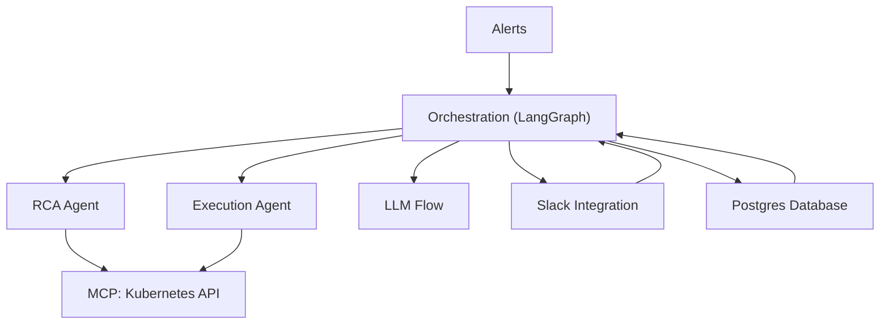

# AIRA – AI Agent with MCP Integration

[](index.md)
[](getting-started.md)

## 🚀 Quick Start

**AIRA** is a modular LangGraph-based AI agent with native MCP (Model Context Protocol) tool integration, designed for Kubernetes operations but easily extensible for other use cases.

👉 **[Start here with the complete documentation →](index.md)**

---

## ✨ Key Features

- ⚙️ **Modular Architecture** – Easy to extend and customize
- 🧩 **Multi-Agent Support** – Run multiple specialized agents within the same system
- 🔧 **MCP Integration** – Native support for Model Context Protocol tools
- 🎯 **Kubernetes-First** – Built specifically for K8s incident response and automation
- 📑 **Documentation-First** – Clear structure for contributors and users
- 🔄 **Automated RCA** – Root Cause Analysis with automated remediation
- 💬 **Slack Integration** – Real-time notifications and feedback collection

---

## 📖 Documentation Overview

### 🏠 [Main Documentation](index.md)
Complete documentation hub with navigation to all sections.

### 🚀 [Getting Started](getting-started.md)
Quick setup guide for local development and Kubernetes deployment.

### 🏗️ Architecture
- **[Overview](architecture/1_overview.md)** – High-level system architecture and design principles
- **[Workflow Graph](architecture/2_workflow-graph.md)** – End-to-end flows and process diagrams
- **[Components](architecture/3_components.md)** – Detailed component breakdown
- **[Data Flow](architecture/4_data-flow.md)** – Information flow and state management

### 🤖 Agents
- **[Kubernetes Agent](agent/1_kubernetes.md)** – RCA and execution agents for K8s operations
- **[Custom Agent Guide](agent/2_custom-agent.md)** – How to add your own specialized agents

### 📚 Usage
- **[Running AIRA](usage/1_running.md)** – Local development and production deployment
- **[Configuration](usage/2_configuration.md)** – Environment setup and customization
- **[Extending](usage/3_extending.md)** – Advanced customization and integration

### 📋 Reference
- **[API Reference](reference/1_api.md)** – HTTP endpoints and webhook specifications
- **[CLI Reference](reference/2_cli.md)** – Command-line interface documentation
- **[Schema Reference](reference/3_schema.md)** – Data models and validation schemas

---

## 🎯 What AIRA Does

AIRA automates incident response for Kubernetes environments by:

1. **Receiving alerts** from monitoring systems (Alert Manager)
2. **Performing Root Cause Analysis** using AI agents with Kubernetes tools
3. **Automatically remediating** common issues when possible
4. **Generating summaries** and recommendations
5. **Notifying teams** via Slack with detailed reports
6. **Learning from feedback** to improve future responses

### Example Workflow: ImagePullBackOff Alert

```
Alert Received → RCA Agent investigates → Execution Agent fixes → Slack notification sent
```

---

## 🛠️ Technology Stack

- **LangGraph** – Workflow orchestration and state management
- **Model Context Protocol (MCP)** – Safe tool integration for Kubernetes operations
- **Python 3.10+** – Core application runtime
- **PostgreSQL** – Incident tracking and feedback storage
- **Slack API** – Team notifications and feedback collection
- **Kubernetes API** – Cluster interaction and remediation

---

## 🚀 Quick Installation

```bash
# Clone the repository
git clone https://github.com/your-org/aira.git
cd aira

# Set up environment
cp .env.example .env
# Edit .env with your configuration

# Deploy to Kubernetes
kubectl apply -f kubernetes/
```

For detailed setup instructions, see the **[Getting Started Guide](getting-started.md)**.

---

## 📊 System Architecture



---

## 🤝 Contributing

AIRA is designed to be easily extensible. See the **[Custom Agent Guide](agent/2_custom-agent.md)** to learn how to add your own specialized agents.

---

## 📄 License

[Add your license information here]

---

## 🔗 Links

- **[Complete Documentation](index.md)** – Full documentation hub
- **[Getting Started](getting-started.md)** – Quick setup guide
- **[Architecture Overview](architecture/1_overview.md)** – System design details
- **[API Reference](reference/1_api.md)** – Technical specifications

---

<div align="center">
  <strong>Ready to get started?</strong><br>
  <a href="index.md">📖 Read the Documentation</a> • 
  <a href="getting-started.md">🚀 Quick Setup</a> • 
  <a href="architecture/1_overview.md">🏗️ Learn Architecture</a>
</div>
