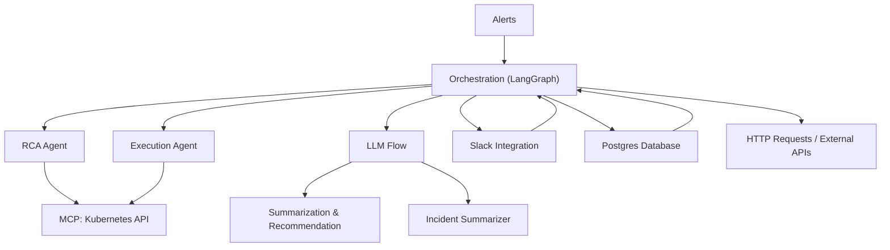

# Architecture Overview

AIRA (AI Agent with MCP Integration) is built on a **modular and layered architecture** that separates core orchestration, specialized agents, and integrations. This design ensures flexibility, scalability, and maintainability.

## High-Level Layers

1. **Orchestration Layer**
   - Built with **LangGraph** to coordinate agent workflows.
   - Manages execution order, error handling, retries, and state transitions.
   - Provides an extensible graph structure for defining pipelines.

2. **Agent Layer**
   - Composed of specialized **AI agents** (nodes) for different tasks:
     - **Root Cause Analysis (RCA) Agent** – investigates possible root causes.
     - **Execution Agent** – applies remediation actions via Kubernetes.
     - **Summarization & Recommendation Agent** – generates recommended actions and insights.
     - **Incident Summarizer Agent** – creates post-incident summaries for reporting.
   - Each agent is modular and reusable within LangGraph.

3. **MCP and other Integration Layer**
   - Uses the **Model Context Protocol (MCP)** specifically for **Kubernetes operations**.
   - RCA and Execution Agents rely on MCP to interact with the Kubernetes API.
   - Other integrations (e.g., **Slack, Postgres, HTTP requests**) connect directly under the orchestration layer, not via MCP.

4. **Data & Persistence Layer**
   - Centralized state management for workflow context.
   - Supports caching intermediate results.
   - Logs execution traces for debugging and auditability.

## Key Design Principles

- **Separation of Concerns** – Each agent handles a focused responsibility.
- **Pluggability** – MCP tools can be added or replaced without breaking the pipeline.
- **Scalability** – Workflows can fan-out or fan-in depending on workload.
- **Observability** – Tracing, logging, and monitoring are first-class citizens.

## Diagram (Conceptual)

---

  <a href="../getting-started.md">⬅️ Previous</a>
  <a href="2_workflow-graph.md">Next ➡️</a>

