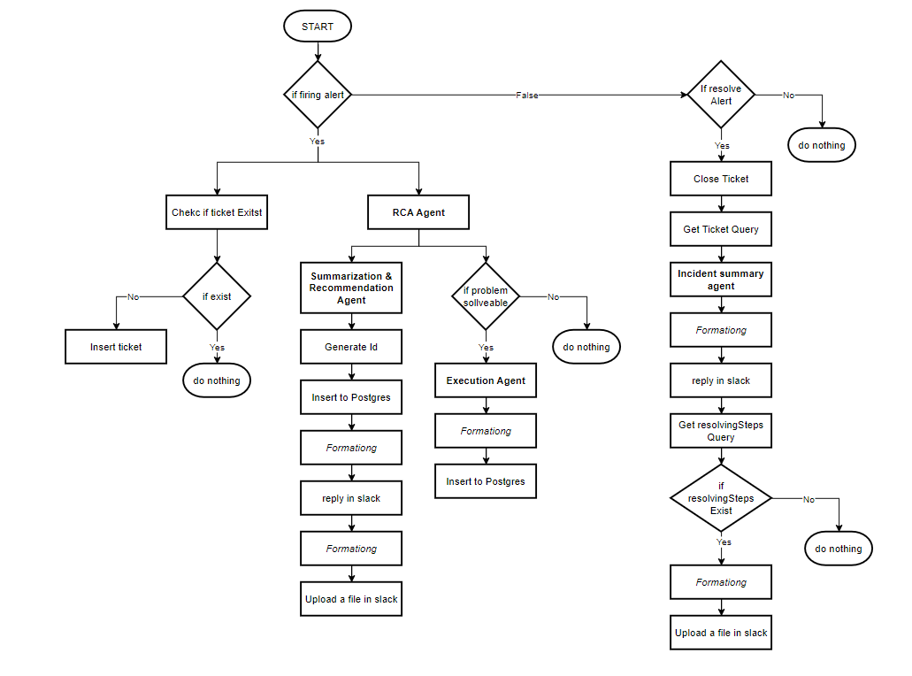
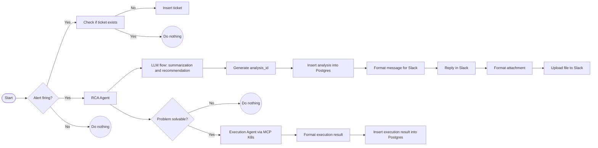
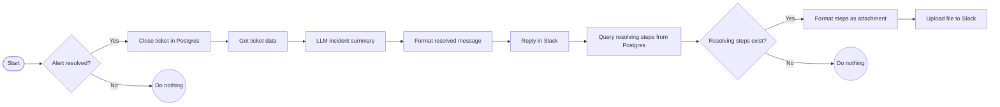
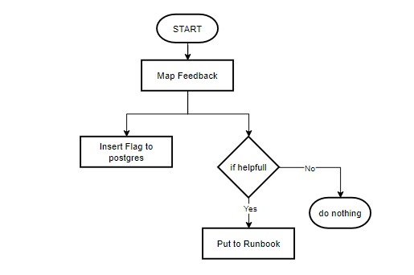
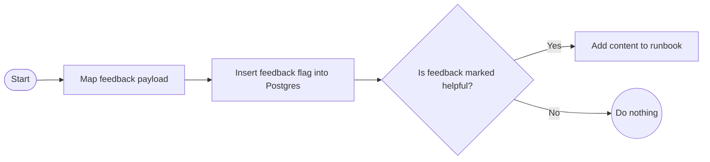

# Workflow Graph

This page documents the end-to-end flows that power AIRA.  
There are three primary workflows:

1. **Alert firing flow** — analyze the alert, optionally execute remediation, summarize, and notify.  
2. **Alert resolved flow** — close ticket, generate a concise resolution message, and publish any resolving steps.  
3. **Feedback ingestion flow** — capture user feedback and promote helpful content into the runbook.

---
## 1. Alert Flow

## A. Alert Firing Flow

**Notes**
- **RCA Agent** and **Execution Agent** issue Kubernetes operations **via MCP**.
- Summarization + recommendation run through a **single LLM flow**, then branch to outputs.
- Slack messages and file uploads are posted via HTTP integrations; database writes use Postgres.

---

## B. Alert Resolved Flow

**Notes**
- The **incident summary** is concise and includes the RCA, the fix, and the ticket id.
- If recorded **resolving steps** exist, they are uploaded as a Slack file.

---

## 2. Feedback Ingestion Flow

**Notes**
- Incoming reactions are normalized (e.g., 👍 → `helpful`, 👎 → `not_helpful`).
- All feedback is stored; only `helpful` items are promoted to the runbook.

---

  <a href="1_overview.md">⬅️ Previous</a>
  <a href="3_components.md">Next ➡️</a>

